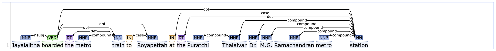

<h1>
    Relation Extraction using Distant Supervision 
</h1>
<h4>
    Rishanth Rajendhran
</h4>
 

<h5>
    Datsets
</h5>

    <ul>
        <li>
            <a href="https://www.microsoft.com/en-us/download/details.aspx?id=52312">
                FB15K-237 Knowledge Base Completion Dataset
            </a>
        </li>
        <li>
            <a href="https://github.com/xiaoling/figer/issues/6">
                Mapping between Freebase MIDs (Machine identifiers) and Wikipedia titles
            </a>
        </li>
        <li>
            Wikipedia articles (Wikipedia Python Module / Hunngingface Wikipedia dump)
        </li>
    </ul>

<h5>
    At the outset
</h5>

    This repository contains the code for a individual research project done as a part of the course
    CS 6390 Information Extraction by Professor Ellen Riloff at The University of Utah. 
     
    This project started out as an effort to build a system to extract family tree information from short stories but ended up getting a broader perspective primarily due to the lack of high-quality human annotated dataset for family tree/relationships extraction.

 

<h5>
    Description
</h5>

    Relation extraction is a task focussed on extracting information about semantic relationship(s) between entities mentioned in a piece of text. For example, “Ryan, director of the Iskar award winning film ‘The thorns in my roses’, was seen yesterday in Salt Lake City.” encodes the following relationship: “The film ‘The thorns in my roses’ was directed by Ryan” or more succinctly (The thorns in my roses’ was directed by Ryan, directedBy, Ryan). In this project, we shall focus on extracting binary relationship between entities.

    Most natural language processing applications today make use of machine learning in some form. The performance of supervised machine learning systems, the most commonly used ML paradigm, depends largely on the quality and size of the labelled dataset. The lack of large human-annotated datasets for the task of relation extraction is an impediment. Other alternatives such as unsupervised ML and semi-supervised ML have their own limitations: The clusters formed using unsupervised techniques cannot directly mapped to real-world relations encoded in ontologies and databases; the seeds used in semi-supervised techniques could suffer from semantic drift. 

    To this end, a new ML paradigm called distant supervision was proposed by Mintz et al. (<a href="https://web.stanford.edu/~jurafsky/mintz.pdf">Link</a>) for the task of relation extraction. In the original paper, distant supervision was provided by relations and relation instances extracted from Freebase, a large knowledge base. of structured data. Once relation instances have been extracted from Freebase, sentences from Wikipedia articles containing both the entities involved in a relation instances are collected to create positive training instances. The intuition is that if two entities are related, then a sentence mentioning both these entities would possibly also mention the relation between these entities. To create negative instances, we take pairs of unrelated entities (entities that do not appear together in any relation instance) and extract sentences which contain both of these entities. 

    We can then generate feature vector representations for these instances using features such as named entity tags for the entities under consideration, context words and their part-of-speech tags etc. These feature vectors could then be used to train a classifier. Several improvements have been introduced in distant supervision over the years and we shall explore some of these methods in this project.

 

<h5>
    Data Description
</h5>

    While the Freebase API has since been deprecated making it impossible to query it now for the data we need, the FB15k dataset, introduced by Bordes et al. (<a href="https://proceedings.neurips.cc/paper/2013/file/1cecc7a77928ca8133fa24680a88d2f9-Paper.pdf">Link</a>), is available. The FB15K-237 Knowledge Base Completion Dataset which we shall be using for this project consists of a subset of relation instances from FB15K dataset which itself was derived from Freebase. This dataset consists of train, validation and test files. Each file consists of a set of relation instances of a large number of Freebase relations in the following format: “(entity_1) (relation) (entity_2)” in every line. 

    Given that the Freebase API is no longer available, we shall make use of a user-generated snapshot of the mapping between Freebase machine identifiers and wikipedia titles in-order to be able to extract relevant sentences from wikipedia articles. In this file, every line defines a mapping between an MID and wikipedia title in the following format: “(mid) (wikipediaTitle)”. Some MID’s can be associated with several Wikipedia titles to take all variants of spelling and synonyms into consideration. 

    We shall use the wikipedia python module to extract wikipedia articles for the various entities obtained from the above two datasets. The articles can then be split into sentences and the sentences can then be used for our application as outlined in the task description.

 

<h5>
    Data Statistics
</h5>

    <table>
        <caption>
            FB15K-237 Knowledge Base Completion Dataset
        </caption>
        <tr>
            <th>
                Dataset
            </th>
            <th>
                #relationInstances
            </th>
            <th>
                #entities
            </th>
            <th>
                #relations
            </th>
            <th>
                Avg. no. of instances per entity
            </th>
            <th>
                % of repetitions
            </th>
        </tr>
        <tr>
            <th>
                Train
            </th>
            <td>
                272115
            </td>
            <td>
                14505
            </td>
            <td>
                237
            </td>
            <td>
                6277
            </td>
            <td>
                6.24
            </td>
        </tr>
        <tr>
            <th>
                Validation
            </th>
            <td>
                17535
            </td>
            <td>
                9809
            </td>
            <td>
                223
            </td>
            <td>
                715
            </td>
            <td>
                0.56
            </td>
        </tr>
        <tr>
            <th>
                Test
            </th>
            <td>
                20466
            </td>
            <td>
                10348
            </td>
            <td>
                224
            </td>
            <td>
                606
            </td>
            <td>
                0.72
            </td>
        </tr>
        <footer>
            If both (entity_1, relation, entity_2) and (entity_2, relation, entity_1) are present, it is considered a repetition.
        </footer>
    </table>

    <b>
        Mapping between Freebase MIDs (Machine identifiers) and Wikipedia titles
    </b>
     
    No. of mappings: 7606464
     
    No. of MIDs: 3305955
     
    Average no. of names per MID: 2.3
     

 

<h5>
    Evaluation Plan
</h5>

    Standard evaluation metrics such as precision and recall are well suited for this task. They can be computed on a per-relation basis and then macro/micro-averaged for getting an overall number. 

    We shall make use of the test split of the FB15K-237 Knowledge Base Completion Dataset for the final evaluation. Much akin to the training process, we shall extract sentences mentioning both the entities involved in a test relation and then feed it to the trained classifier to obtain the relation label. We can then compare this label with the gold label present in the test file.

 

<h5>
    Demo Plan
</h5>

    The input to the model shall be a pair of entities and a set of sentences containing both the entities. The output of the model would be the relation (as encoded in Freebase) between the two entities are reflected by the input sentences.

 
    While the ultimate goal would be to build a user-friendly website (possibly using React and Flask) where the user can submit the input through a form and the response gets returned and presented in a readable manner, initial iterations would simply make use of the command-line terminal.

 
<h5>
    External Tools
</h5>
<h6>
    Phase 1
<h6>

    The major external tools/packages/modules used in this project:
    <ul>
        <li>
            wikipedia python API (for extracting wikipedia articles and summaries)
        </li>
        <li>
            PyTerrier (for inverted index)
        </li>
        <li>
            neuralcoref (for coreference resolution) (A neural network model using reinforcement learning based rewards based on <a href="https://aclanthology.org/D16-1245.pdf"> Deep Reinforcement Learning for Mention-Ranking Coreference Models by Clark et al.</a>)
        </li>
        <li>
            SpaCy (for named-entity recognition and dependency parsing)
        </li>
        <li>
            nltk (for word tokenization, sentence tokenization and part-of-speech tagging)
        </li>
        <li>
            huggingface (for transformers (BERT model))
        </li>
        <li>
            PyTorch (for linear layers, optimizers and loss functions)
        </li>
    </ul>

<h6>
    Phase 2
<h6>

    The major external tools/packages/modules used in this project:
    <ul>
        <li>
            PyTerrier (for inverted index)
        </li>
        <li>
            neuralcoref (for coreference resolution) (A neural network model using reinforcement learning based rewards based on <a href="https://aclanthology.org/D16-1245.pdf"> Deep Reinforcement Learning for Mention-Ranking Coreference Models by Clark et al.</a>)
        </li>
        <li>
            SpaCy (for named-entity recognition)
        </li>
        <li>
            nltk (for word tokenization, sentence tokenization and part-of-speech tagging)
        </li>
        <li>
            huggingface (or Wikipedia articles and transformers (BERT model))
        </li>
        <li>
            PyTorch (for linear layers, optimizers and loss functions)
        </li>
    </ul>

<h5>
    Pipeline
</h5>
<h6>
    Phase 1
<h6>

    <ol>
        <li>
            Extract entities, relations and relation instances 
        </li>
        <li>
            Extract wikipedia articles for entities using information in mid2name mapping
        </li>
        <li>
            Apply coreference resolution over the extracted wikipedia articles
        </li>
        <li>
            Extract out sentences from coreference resolved wikipedia articles
        </li>
        <li>
            Build a inverted index treating sentences as documents 
        </li>
        <li>
            Generate positive examples by searching the inverted index for sentences containing both entities involved in a relation
        </li>
        <li>
            Generate negative examples from entity pairs not involved in a relation using a similar approach as in (6)
        </li>
        <li>
            Sample examples from the generated set of examples extracting out names for entities from sentences 
        </li>
        <li>
            Limit the number of examples per relation to ensure resulting set of examples are not too skewed
        </li>
        <li>
            Build a model using the examples
        </li>
    </ol> 

<h6>
    Phase 2
</h6>

    <li>
        Extract entities, relations and relation instances
    </li>
    <li>
        Extract wikipedia articles for entities using information in mid2name mapping
    </li>
    <li>
        Apply coreference resolution over the extracted wikipedia articles selectively
    </li>
    <li>
        Extract out sentences from coreference resolved wikipedia articles
    </li>
    <li>
        Build a inverted index treating sentences as documents
    </li>
    <li>
        Generate positive examples by searching the inverted index for sentences containing both entities involved in a relation
    </li>
    <li>
        Generate negative examples from entity pairs not involved in a relation using a similar approach as in (6)
    </li>
    <li>
        Sample examples from the generated set of examples extracting out names for entities from sentences with a “high” reliability threshold; filter out sentences where both entities have “similar” names
    </li>
    <li>
        Limit the number of examples per relation to ensure resulting set of examples is not too skewed
    </li>
    <li>
        Mark entities in sentences using entity markers (<RELATION-S>, <RELATION-O>) or named entity tags (PER, LOC, GPE etc)
    </li>
    <li>
        Add entity markers/named entity tags to the vocabulary of tokenizer to avoid splitting.
    </li>
    <li>    
        Build a model using the examples
    </li>

<h5>
    Design Choices
</h5>
<h6>
    Phase 1
</h6>

    Ten relations randomly were randomly extracted from the 250-odd relations available in the datasets. Wikipedia articles were extracted for entities involved in these relations and an inverted index was built over the sentences in these documents. A coreference resolution system (with about 80% precision and 70% recall) was run over the wikipedia articles to maximize the number of sentences having explicit mentions of entities. Examples were then generated by retrieving sentences from the inverted index containing both entities involved in a relation. Due to memory constraints, the top two relations based on counts were chosen instead of the 10 randomly chosen relations and the entire process was repeated. 
     
    An attempt was made to extract somatic and lexical features mentioned in Distant supervision for relation extraction without labeled data but the problem of sparsity became a roadblock. While the authors of the paper used a dataset in the order of a few millions, the datasets used for this project were considerably smaller (in the order of a few thousands). The idea was to start out with a traditional machine learning classifier and use it as a baseline for the successive phases which were planned to make use of neural network models. Various tools were explored and features for the available data were built but eventually a decision was made to drop the idea of using traditional machine learning approach.
     
    Due to lack of sufficient data and time, it was decided to implement a BiLSTM layer followed by a simple linear layer on top of BERT primarily because the BERT model accepts plain text as input. The fact that these large scale language models do not require explicit feature engineering was a huge advantage given the constraints on time. However, these models require large amount of memory and compute to train and test and this was a challenge. 

<h6>
    Phase 2
</h6>

    Top 17 relations were extracted based on the number of relation instances in the train set. Four relations were manually chosen with a goal of having a diverse set of relations and entities involved in the relation. 
     
    Wikipedia articles were taken from the Huggingface English Wikipedia dump instead of the wikipedia Python API as the articles in the Huggingface dump are cleaned and free of formatting.
     
    To counter the problem of the aggressive coreference resolution performed by the neuralcoref model observed in phase 1, coreference resolution was performed selectively: anaphors in the sentence containing the antecedent were not replaced, exactly one anaphor referring to the same antecedent in a given sentence was replaced with the antecedent. Dropping coreference resolution was also considered but it was ultimately decided to use it to avoid not having enough example sentences for the relation instances. 
     
    To tackle the problem of noisy example sentences, a higher reliability threshold was used in this phase (F1 score > 0.8). Additionally, sentences where the names of both the entities were too similar were discarded. 
     
    Entity pair under consideration was marked in the sentence with the tags: <RELATION-S>, <RELATION-O>, depending on whether they appeared on the left side or the right side of the relation. An attempt was made to use the Spacy NER tagger (en_core_web_lg) to tag the named entities in the example sentences but the attempt was dropped due to lack of adequate compute resources.
     
    Unlike in phase 1 where every sentence containing both the entities under consideration was considered as an individual example for the relation that exists between those entities, in this phase all sentences containing both the entities under consideration were consolidated as one example expressing the relation that exists between those entities. The hope is that even if some non-informative sentences had crept in due to the distant supervision approach, the model would learn to selectively look at the most useful sentences.
     
    Resampling was employed during training phase to counter data imbalance. 

<h5>
    Model
</h5>
<h6>
    Phase 1
</h6>

    BiLSTM followed by a linear fully-connected layer on top of BERT (bert-base-uncased) followed by a classification layer was built. The intuition was that BERT would generate a good representation at the world level which can they be fed to the BiLSTM layer which would learn features at the sentences level, features which can then be fed to a linear layer before taking a softmax to get probabilities for the class labels. 

<h6>
    Phase 2
</h6>

    Given an entity pair involved in a relation, all sentences containing both the entities are fed to the BERT model to obtain contextualized word embeddings. The word embeddings for the start tag of the entities of interest (<RELATION-S> and <RELATION-O>) were extracted and concatenated. The concatenated span representation for all the sentences were fed to the attention layer which weights the sentences based on how useful they are for the classification task. The weighted-averaged sentence representation is then fed to a BiLSTM layer, the output of which is fed to a linear classification layer. 

<h5>
    Compute Time
</h5>
<h6>
    Phase 1
</h6>

    Training: ~2.5 hours for 20 epochs (on a GPU)
     
    Evaluation: ~0.5 hours (on a GPU)

<h6>
    Phase 2
</h6>

    Training: ~3.5 hours for 20 epochs (on a GPU)
     
    Evaluation: ~0.5 hours (on a GPU)

<h5>
    Analysis
</h5>
<h6>
    Phase 1
</h6>

    An inspection of the examples generated using the distant supervision approach revealed certain inadequacies in the retrieval process. The reliability threshold (used to check if a sentence containing some or all parts of the names of the two entities under consideration) was kept low (should retrieve at least 2 words for names having 2 or more words) for this phase  to improve recall. The examples generated using such a low reliability threshold are extremely poor. For example: Sentences containing “United States” are marked as sentences containing “New York, United States” which is unacceptable. Higher reliability threshold (80-90% of all words in the name) can help avert this problem but it is also to be seen if enough examples can be extracted with such a high threshold. 
     
    Another solution to the above problem is feeding all sentences containing both the entities under consideration as input at once instead of feeding them as separate examples. The hope is that at least some of those sentences would encode the relationship under consideration between those two entities if not all. The problem with such an approach is that BERT can only handle short-span texts which means documents would have to be broken down into smaller chunks and then the representation for these smaller chunks would have to be somehow aggregated before feeding it to a classification layer(s)/LSTM layer(s). Some papers report that the performance of such an approach is poor. Also, a large amount of compute would be needed for such an undertaking.
     
    Another solution could be using more relations and entities which in turn would give more examples. One major hurdle would be the compute needed to handle large amounts of data while training models.
     
    Looking at the some of the mis-predictions, it is clear that there is a need to include the entity pairs in the model either as an input, in which case the model would be trained to predict if there exists a relationship between the two entities that can be supported by the input sentence containing both these entities, or as a part of the output, in which case the model would take in a sentence as an input and output a relationship and a entity pair (if a relationship exists). Alternately, relation detection can be decoupled from the entity identification process.
     
    (Eg.)
     
    Text: In January 1955, the Gibbs moved back to Manchester, Lancashire, England.
     
    True: None (between Gibbs and England)
     
    Prediction: Contains (is true between Manchester and England, Lancashire and England and Manchester and Lancashire)
     
    The coreference resolution system applied on the wikipedia articles seems to have made some sentences sound unnatural. In some cases, it also seems to have gotten it wrong thereby making some of the examples wrong. By using the coreference resolution system, it was hoped that more sentences could be extracted but at the same time it is not a good idea to provide flawed data to the model. Investigations need to be performed to see if enough sentences can be generated without coreference resolution. 

<h6>
    Phase 2
</h6>

    Named entity information can be valuable as the model can use it to learn what entities are usually involved in a given relation and in which position. This could improve recall for none relation and precision for the non-none relations. 
     
    Since the Spacy NER model is unable to recognize some entities of interest (such as professions), building an NER system to predict NE tags of interest in this setting could help improve the quality of the data given to the relation extraction system. It would be interesting to experiment with both multi-task learning architectures as well as a pipelined architectures. 
     
    Better quality of negative examples can be generated by looking for sentences with exact matches of entity names. Also picking entities with entity type pairs which do not correspond to any recognized relation can help avoid false negatives. 
     
    Reverse entity pairs can also be fed as negative examples. This might solve the problem observed in the evaluation where the model predicts a relation R for both (A as S, B as O) and (B as S, A as O) where A and B are entities and S and O stand for subject and object.
     
    Currently example sentences are being extracted whenever both the entities under consideration find a mention in the sentence. Sometimes, this extracts noisy sentences which do not really speak about the intended relation between those entities. One such example scenario is where the entity name is actually a part of the larger noun phrase 
     
    (Eg.) 
     
    Text: Jayalalitha boarded the metro train to Royapettah at the Puratchi Thalaivar Dr. M.G. Ramachandran metro station
     
    Say we are interested in the following entities: (Jayalalitha, M.G. Ramachandran)
     
    Say the relation between these entities is “politics/heir”
     
    This sentence would be extracted by our current distant supervision approach simply because it contains both the desired entity names but the above sentence is not useful for two reasons: One, the sentence does not encode the fact that Jayalalitha is the political heir of M.G. Ramachandran. Two, the sentence is not talking about the person M.G. Ramachandran at all! It is only talking about a metro station named after M.G. Ramachandran. 
     
    In this case, the entity name we are interested in (M.G. Ramachandran) is a noun modifier to the head noun (metro station). While it is expected that the contextualized word embedding by BERT captures this fact, the model could benefit from this part-of-speech information being explicitly given as input. 
     
    Giving dependency path information explicitly could also help the model in this case:
     
    

<h5>
    Files
</h5>

    <ul>
        <li>
            <h6>
                generateData.py
            </h6>
            

                This file is used for the following operations:
                <ol>
                    <li>
                        Extract relations, entities and mid2name mappings from txt files
                    </li>
                    <li>
                        Pick relation instances for given set of relations/randomly sampled relations
                    </li>
                    <li>
                        Extract random wikipedia articles
                    </li>
                    <li>
                        Extract wikipedia articles/summaries for a given set of entities
                    </li>
                </ol>
            

            

                <h6>
                    Usage
                </h6>
                <pre>
usage: generateData.py [-h] [-debug] [-log LOG] [-map MAP] [-train TRAIN] [-valid VALID] [-test TEST] -mode {train,test,valid}
    [-load] [-pickRelations PICKRELATIONS] [-wiki] [-numSamples NUMSAMPLES] [-mid2name MID2NAME]
    [-entities ENTITIES] [-relations RELATIONS] [-wikiArticles WIKIARTICLES] [-article]
    [-maxInstsPerRel MAXINSTSPERREL] [-random]

options:
-h, --help            show this help message and exit
-debug                Boolean flag to enable debug mode
-log LOG              Path to file to print logging information
-map MAP              Path to TSV file containing mappings between MIDs and wikipedia titles
-train TRAIN          Path to txt train file containing relation instances
-valid VALID          Path to txt train file containing relation instances
-test TEST            Path to txt train file containing relation instances
-mode {train,test,valid}
                        Used to indicate the type of file being worked on (mappings would be extracted from mid2name only in train mode)
-load                 Boolean flag to indicate that mappings and relation/entities can be loaded
-pickRelations PICKRELATIONS
                        Flag to enable pickRelations mode and specify no. of relations to pick/text file containing relations to pick one per line
-wiki                 Boolean flag to enable wiki mode
-numSamples NUMSAMPLES
                        No. of relations sampled (Used for file naming purposes)
-mid2name MID2NAME    Path to file containing mid2name dictionary
-entities ENTITIES    Path to file containing entities dictionary
-relations RELATIONS  Path to file containing relations dictionary
-wikiArticles WIKIARTICLES
                        Path to file containing wiki articles list
-article              Boolean flag to be used in wiki mode to generate articles instead of summaries
-maxInstsPerRel MAXINSTSPERREL
                        Max. no. of instances per relation in pickRelation mode
-random               Boolean flag to be used in wiki mode to generate random articles
                </pre>
            

        </li>
        <li>
            <h6>
                buildInvertedIndex.py
            </h6>
            

                This file is used to perform the following operarions:
                <ol>    
                    <li>
                        Perform coreference resolution on wiki articles/summaries
                    </li>
                    <li>
                        Extract sentences from articles
                    </li>
                    <li>
                        Build a terrier index over all the articles
                    </li>
                </ol>
            

            

                <h6>
                    Usage
                </h6>
                <pre>
usage: generateData.py [-h] [-debug] [-log LOG] [-map MAP] [-train TRAIN] [-valid VALID] [-test TEST] -mode {train,test,valid}
                       [-load] [-pickRelations PICKRELATIONS] [-wiki] [-numSamples NUMSAMPLES] [-mid2name MID2NAME]
                       [-entities ENTITIES] [-relations RELATIONS] [-wikiArticles WIKIARTICLES] [-article]
                       [-maxInstsPerRel MAXINSTSPERREL] [-random]

options:
  -h, --help            show this help message and exit
  -debug                Boolean flag to enable debug mode
  -log LOG              Path to file to print logging information
  -map MAP              Path to TSV file containing mappings between MIDs and wikipedia titles
  -train TRAIN          Path to txt train file containing relation instances
  -valid VALID          Path to txt train file containing relation instances
  -test TEST            Path to txt train file containing relation instances
  -mode {train,test,valid}
                        Used to indicate the type of file being worked on (mappings would be extracted from mid2name only in train
                        mode)
  -load                 Boolean flag to indicate that mappings and relation/entities can be loaded
  -pickRelations PICKRELATIONS
                        Flag to enable pickRelations mode and specify no. of relations to pick/text file containing relations to
                        pick one per line
  -wiki                 Boolean flag to enable wiki mode
  -numSamples NUMSAMPLES
                        No. of relations sampled (Used for file naming purposes)
  -mid2name MID2NAME    Path to file containing mid2name dictionary
  -entities ENTITIES    Path to file containing entities dictionary
  -relations RELATIONS  Path to file containing relations dictionary
  -wikiArticles WIKIARTICLES
                        Path to file containing wiki articles list
  -article              Boolean flag to be used in wiki mode to generate articles instead of summaries
  -maxInstsPerRel MAXINSTSPERREL
                        Max. no. of instances per relation in pickRelation mode
  -random               Boolean flag to be used in wiki mode to generate random articles
                </pre>
            

        </li>
        <li>
            <h6>
                generateExamples.py
            </h6>
            

                This file is used to perform the following operarions:
                <ol>    
                    <li>
                        Generate examples by finding sentences containing both enities involved in a relation
                    </li>
                    <li>
                        Generate negative examples by finding sentences containing both enities not involved in any relation
                    </li>
                </ol>
            

            

                <h6>
                    Usage
                </h6>
                <pre>
usage: generateExamples.py [-h] [-debug] [-log LOG] [-mid2name MID2NAME] [-entities ENTITIES] [-relations RELATIONS] -invertedIndex INVERTEDINDEX -docs DOCS [-negative]
                           [-numExamples NUMEXAMPLES] [-out OUT] [-allEntities ALLENTITIES [ALLENTITIES ...]]

options:
  -h, --help            show this help message and exit
  -debug                Boolean flag to enable debug mode
  -log LOG              Path to file to print logging information
  -mid2name MID2NAME    Path to file containing mid2name dictionary
  -entities ENTITIES    Path to file containing entities dictionary
  -relations RELATIONS  Path to file containing relations dictionary
  -invertedIndex INVERTEDINDEX
                        Path to Terrier index folder
  -docs DOCS            Path to documents file (extension='.pkl')
  -negative             Boolean flag to generate negative examples
  -numExamples NUMEXAMPLES
                        No. of negative examples to generate
  -out OUT              Path to store examples (extension=.pkl)
  -allEntities ALLENTITIES [ALLENTITIES ...]
                        Negative examples: List of path to all entity files containing entities dictionary
                </pre>
            

        </li>
        <li>
            <h6>
                sampleExamples.py
            </h6>
            

                This file is used to perform the following operarions:
                <ol>    
                    <li>
                        Extract examples and transform them to a format than can be fed to a model
                    </li>
                </ol>
            

            

                <h6>
                    Usage
                </h6>
                <pre>
usage: sampleExamples.py [-h] [-debug] [-log LOG] [-mid2name MID2NAME] -examples EXAMPLES [EXAMPLES ...] -numSamplesPerReln NUMSAMPLESPERRELN [-out OUT]
                         [-pickRelations PICKRELATIONS] [-append]

options:
  -h, --help            show this help message and exit
  -debug                Boolean flag to enable debug mode
  -log LOG              Path to file to print logging information
  -mid2name MID2NAME    Path to file containing mid2name dictionary
  -examples EXAMPLES [EXAMPLES ...]
                        List of paths to files containing examples
  -numSamplesPerReln NUMSAMPLESPERRELN
                        No. of samples to pick per relation
  -out OUT              Path to sampled examples (extension=.pkl)
  -pickRelations PICKRELATIONS
                        Flag to enable pickRelations mode and specify no. of relations to pick/text file containing relations to pick one per line
  -append               Boolean flag to aappend to old output
                </pre>
            

        </li>
        <li>
            <h6>
                buildModel.py
            </h6>
            

                This file is used to perform the following operarions:
                <ol>    
                    <li>
                        Build the model
                    </li>
                    <li>
                        Train the model
                    </li>
                    <li>
                        Evaluate the model
                    </li>
                </ol>
            

            

                <h6>
                    Usage
                </h6>
                <pre>
usage: buildModel.py [-h] [-debug] [-log LOG] [-train TRAIN] [-valid VALID] [-test TEST] [-trainValTest] [-histogram] [-maxLen MAXLEN] -batchSize BATCHSIZE
                     -learningRate LEARNINGRATE [-pretrainedModel {bert-base-uncased,bert-base-cased}] [-epochs EPOCHS] [-load LOAD] [-maxSents MAXSENTS]
                     [-numAttnHeads NUMATTNHEADS]

options:
  -h, --help            show this help message and exit
  -debug                Boolean flag to enable debug mode
  -log LOG              Path to file to print logging information
  -train TRAIN          Path to file containing training examples (extension=.pkl)
  -valid VALID          Path to file containing validation examples (extension=.pkl)
  -test TEST            Path to file containing test examples (extension=.pkl)
  -trainValTest         Boolean flag to split train set into train, validation and test set
  -histogram            Boolean flag to show histogram of examples
  -maxLen MAXLEN        Maximum length of input tokens (tokenizer)
  -batchSize BATCHSIZE  Batch size for dataloader
  -learningRate LEARNINGRATE
                        Learning rate for training
  -pretrainedModel {bert-base-uncased,bert-base-cased}
                        Pretrained BERT model to use
  -epochs EPOCHS        No. of epochs to train for
  -load LOAD            Path to file containing model to load
  -maxSents MAXSENTS    Maximum no. of sentences per examples
  -numAttnHeads NUMATTNHEADS
                        No. of attention heads
                </pre>
            

        </li>
        <li>
            <h6>
                testModel.py
            </h6>
            

                This file is used to perform the following operarions:
                <ol>    
                    <li>
                        Test the model on a test file
                    </li>
                    <li>
                        Do a live demo
                    </li>
                    <li>
                        Evaluate baseline models
                    </li>
                </ol>
            

            

                <h6>
                    Usage
                </h6>
                <pre>
usage: testModel.py [-h] [-debug] [-log LOG] [-model MODEL] [-test TEST] [-maxLen MAXLEN] [-batchSize BATCHSIZE]
                    [-pretrainedModel {bert-base-uncased,bert-base-cased}] [-live] [-examples EXAMPLES [EXAMPLES ...]] [-confusion] [-maxSents MAXSENTS]
                    [-histogram] [-entities ENTITIES [ENTITIES ...]] [-savePredictions] [-printPredictions] [-baseline {majority,random}]

options:
  -h, --help            show this help message and exit
  -debug                Boolean flag to enable debug mode
  -log LOG              Path to file to print logging information
  -model MODEL          Path to file containing RelClassifier model (extension= .pt)
  -test TEST            Path to file containing test examples (extension=.pkl)
  -maxLen MAXLEN        Maximum length of input tokens (tokenizer)
  -batchSize BATCHSIZE  Batch size for dataloader
  -pretrainedModel {bert-base-uncased,bert-base-cased}
                        Pretrained BERT model to use
  -live                 Boolean flag to enable live demo mode
  -examples EXAMPLES [EXAMPLES ...]
                        Example sentences to test the model on in live demo mode
  -confusion            Boolean flag to plot confusion matrix after evaluation
  -maxSents MAXSENTS    Maximum no. of sentences per examples
  -histogram            Boolean flag to show histogram of examples
  -entities ENTITIES [ENTITIES ...]
                        List of entities to consider in examples passed in live demo mode with entityPairs flag enabled
  -savePredictions      Boolean flag to save predictions
  -printPredictions     Boolean flag to print predictions
  -baseline {majority,random}
                        Test Baseline models
                </pre>
            

        </li>
    </ul>

<h5>
    Literature Review
</h5>

    <b>
        Distant Supervision
    </b>
    <ol>
        <li>
            <a href="https://dl.acm.org/doi/10.5555/1690219.16902872">
                Distant supervision for relation extraction without labeled data
            </a>
        </li>
        <li>
            <a href="https://aclanthology.org/D12-1042/">
                Multi-instance Multi-label Learning for Relation Extraction
            </a>
        </li>
        <li>
            <a href="https://www.semantic-web-journal.net/content/relation-extraction-web-using-distant-supervision">
                Relation Extraction from the Web using Distant Supervision
            </a>
        </li>
        <li>
            <a href="https://aclanthology.org/C16-1139/">
                Relation Extraction with Multi-instance Multi-label Convolutional Neural Networks
            </a>
        </li>
        <li>
            <a href="https://dl.acm.org/doi/10.5555/3298483.3298679">
                Distant supervision for relation extraction with sentence-level attention and entity descriptions
            </a>
        </li>
        <li>
            <a href="https://dl.acm.org/doi/10.1609/aaai.v33i01.33017418">
                Distant supervision for relation extraction with linear attenuation simulation and non-IID relevance embedding
            </a>
        </li>
    </ol>
    <b>
        Other
    </b>
    <ol>
        <li>
            <a href="https://www.researchgate.net/publication/265006408_A_Review_of_Relation_Extraction">
                A Review of Relation Extraction
            </a>
        </li>
        <li>
            <a href="https://aclanthology.org/2020.aacl-main.75/">
                More Data, More Relations, More Context and More Openness: A Review and Outlook for Relation Extraction
            </a>
        </li>
    </ol>

